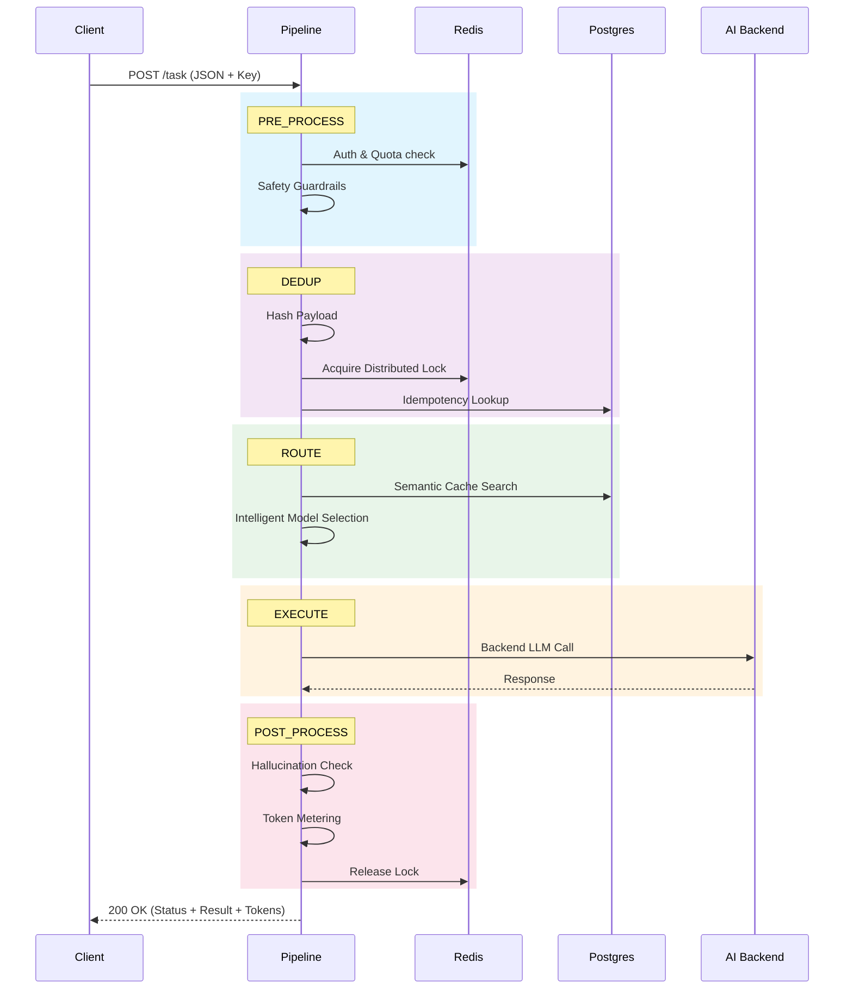
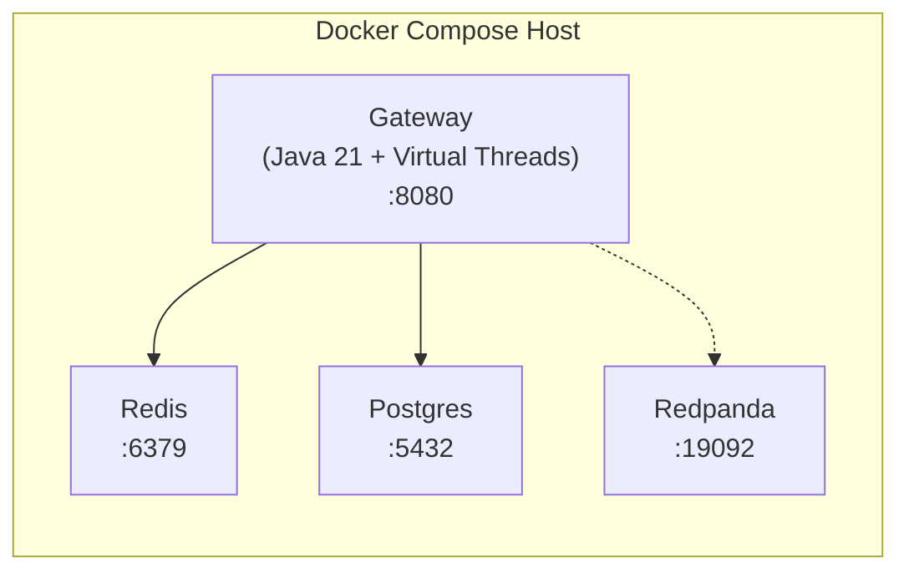

# High-Level Design (HLD)

## System Overview

LumeBridge is a Dual-Mode Intelligent Gateway that sits between clients and backend services. It provides managed concurrency, deduplication, and (optionally) semantic intelligence for AI workloads.

**Architecture:** Plugin-based Modular Monolith. A thin core pipeline engine runs plugins in order. Features are compiled in but activated via configuration. Disabled features have zero runtime cost.

> See [architecture-decision.md](architecture-decision.md) for the full analysis of monolith vs microservice vs plugin.

## System Architecture Overview

LumeBridge is structured as a **Modular Monolith** where a thin core engine coordinates a series of pluggable middleware layers.

```mermaid
flowchart TB
    subgraph Clients ["fa:fa-users External Clients"]
        direction LR
        REST["REST API"]
        MCP["MCP Agent"]
    end

    subgraph Gateway ["fa:fa-server LumeBridge AI Gateway"]
        direction TB
        
        subgraph Stage1 ["Stage 1: PRE_PROCESS (Security & Safety)"]
            P1_1("fa:fa-key ApiKeyAuth")
            P1_2("fa:fa-shield SafetyGuardrails")
            P1_3("fa:fa-timer ClientQuota")
            P1_4("fa:fa-lock ConcurrencyGate")
        end

        subgraph Stage2 ["Stage 2: DEDUP (Reliability)"]
            P2_1("fa:fa-fingerprint PayloadHasher")
            P2_2("fa:fa-database TaskIdempotency")
            P2_3("fa:fa-list-ol NonceOrdering")
        end

        subgraph Stage3 ["Stage 3: ROUTE (Intelligence)"]
            P3_1("fa:fa-route IntelligentRouter")
            P3_2("fa:fa-memory SemanticCache")
        end

        subgraph Stage4 ["Stage 4: EXECUTE (Resilience)"]
            P4_1("fa:fa-plug CircuitBreaker")
            P4_2("fa:fa-rotate SmartRetry")
        end

        subgraph Stage5 ["Stage 5: POST_PROCESS (Quality)"]
            P5_1("fa:fa-magnifying-glass ResponseEvaluator")
            P5_2("fa:fa-calculator TokenMeter")
            P5_3("fa:fa-broadcast-tower Telemetry")
        end

        Stage1 --> Stage2 --> Stage3 --> Stage4 --> Stage5
    end

    subgraph Infra ["fa:fa-cubes Infrastructure Layer"]
        Redis[(Redis 7)]
        Postgres[(Postgres 16)]
        Redpanda[(Redpanda)]
    end

    Clients --> Gateway
    Gateway <--> Redis
    Gateway <--> Postgres
    Gateway -.-> Redpanda

    %% Styling
    style Stage1 fill:#e1f5fe,stroke:#01579b
    style Stage2 fill:#f3e5f5,stroke:#4a148c
    style Stage3 fill:#e8f5e9,stroke:#1b5e20
    style Stage4 fill:#fff3e0,stroke:#e65100
    style Stage5 fill:#fce4ec,stroke:#880e4f
    style Redis fill:#ffffff,stroke:#d32f2f
    style Postgres fill:#ffffff,stroke:#1976d2
    style Redpanda fill:#ffffff,stroke:#333
```



    DistLock --> Redis
    PayloadHasher --> Postgres
    SemanticCache --> Postgres
    StaleDataCleaner --> Postgres
    LockMetrics -.-> Redis
    Telemetry -.->|"traces"| Redpanda
```

> **Note:** Dashed connections are optional (only active when the plugin is enabled). The full chain above shows all plugins enabled. In a lightweight deployment, only Core + a few plugins are active.

## Pipeline Stages

The Pipeline Engine runs plugins in fixed stage order. Within each stage, plugins execute by their `Order()` value.

```
PRE_PROCESS → DEDUP → ROUTE → EXECUTE → POST_PROCESS → BACKGROUND
```

| Stage | Purpose | Core/Plugin Components |
|---|---|---|
| PRE_PROCESS | Input validation, normalization, security, safety | **Core:** Concurrency Gate. **Plugin:** API Key Auth, Safety Guardrails, Client Quota, Payload Normalizer, PII Scrubber |
| DEDUP | Hashing, locking, idempotency, ordering | **Core:** Payload Hasher, Distributed Lock. **Plugin:** Idempotency, Collision Detection, Nonce Ordering |
| ROUTE | Protocol detection, cache lookup, routing | **Plugin:** Dual-Mode Router, Intelligent Router, Semantic Cache, Intent Classifier |
| EXECUTE | Backend calls with protection | **Plugin:** Circuit Breaker, Smart Retry |
| POST_PROCESS | Response handling, cleanup, failure routing, evaluation | **Plugin:** DLQ, Response Evaluator, Token Meter, Lock Metrics, Telemetry |
| BACKGROUND | Non-request tasks (timers, exporters) | **Plugin:** Stale Data Cleaner, Metrics Exporter |

## Plugin Interface

Every plugin implements one interface:

```java
public interface Plugin {
    String name();                         // e.g., "safety-guardrails"
    Stage stage();                         // PRE_PROCESS, DEDUP, etc.
    int order();                           // Execution order within stage
    void init(Map<String, String> config); // Setup connections
    MiddlewareFunc middleware();           // Logic: (ctx, next) -> { ... }
    void close();                          // Cleanup on shutdown
}
```

## End-to-End Sequence Diagram (Full Flow)



## Component Responsibilities

### Core (always active, cannot be disabled)

| Component | Responsibility | Stage | Order |
|---|---|---|---|
| Pipeline Engine | Middleware framework that runs plugins in stage order | -- | -- |
| Concurrency Gate | Limits max in-flight requests via semaphore | PRE_PROCESS | 1 |
| Payload Hasher | Deterministic SHA-256 hashing for dedup keys | DEDUP | 1 |
| Distributed Lock | Redis SETNX with TTL; Lua-based safe release | DEDUP | 2 |

### Plugins (enabled via configuration)

| Plugin | Responsibility | Stage | Order | Default |
|---|---|---|---|---|
| API Key Auth | Validates credentials against Redis | PRE_PROCESS | 0 | OFF |
| Payload Normalizer | Validates, canonicalizes, and normalizes payloads | PRE_PROCESS | 1 | OFF |
| PII Scrubber | Masks sensitive data before AI processing | PRE_PROCESS | 2 | OFF |
| Safety Guardrails | Detects jailbreaks and restricted topics | PRE_PROCESS | 3 | ON |
| Client Quota | Enforces per-client rate limits via Redis | PRE_PROCESS | 4 | OFF |
| Idempotency Engine | Skips reprocessing via payload_hash lookup | DEDUP | 3 | ON |
| Nonce Ordering | Rejects stale/out-of-order events (per-request opt-in) | DEDUP | 4 | ON (dormant) |
| Collision Detection | Detects backend state drift with configurable modes | DEDUP | 5 | OFF |
| Dual-Mode Router | Routes REST vs MCP/JSON-RPC traffic | ROUTE | 1 | ON |
| Semantic Cache | pgvector similarity search for AI query caching | ROUTE | 2 | OFF |
| Intent Classifier | Decides cache-hit vs live API call | ROUTE | 3 | OFF |
| Intelligent Router | Multi-model failover and cost routing | ROUTE | 4 | OFF |
| Circuit Breaker | Protects backends from cascade failures | EXECUTE | 1 | OFF |
| Smart Retry | Layered error classification with exponential backoff | EXECUTE | 2 | OFF |
| DLQ Producer | Publishes permanently failed tasks to Redpanda | POST_PROCESS | 1 | OFF |
| Lock Metrics | Records lock contention, hold duration, hot keys | POST_PROCESS | 2 | OFF |
| Telemetry | Distributed tracing via OpenTelemetry | POST_PROCESS | 3 | OFF |
| Response Evaluator | Hallucination and grounding detection | POST_PROCESS | 4 | ON |
| Token Meter | Estimates token usage for cost tracking | POST_PROCESS | 5 | ON |
| Stale Data Cleaner | Purges old completed/failed tasks from Postgres | BACKGROUND | 1 | OFF |
| Metrics Exporter | Exposes metrics in prometheus/otlp/json format | BACKGROUND | 2 | OFF |

## Deployment Profiles

Pre-configured plugin combinations for common use cases:

| Profile | Plugins Enabled | RSS | Use Case | Infrastructure |
|---|---|---|---|---|
| **api-minimal** | Auth, Gate, Hasher, Lock, Persistence, Router | ~15MB | Secure REST API gateway | Redis + Postgres |
| **ai-minimal** | api-minimal + Intelligent Router | ~18MB | Secure AI gateway | Redis + Postgres |
| **api-pro** | api-minimal + Quota, Normalizer, Nonce, Collision, Retry, Breaker, Metrics, Cleaner | ~30MB | Production REST APIs | Redis + Postgres |
| **ai-pro** | ai-minimal + Intent, Safety, Cache, PII, Evaluator, Token Meter, Retry, Breaker | ~65MB | Production AI workloads | Redis + Postgres (pgvector) |
| **hybrid** | **All 25+ Plugins** (Pro API + Pro AI + DLQ + Telemetry) | ~85MB | Full-featured dual-mode gateway | Redis + Postgres + Redpanda |

## Master Flow Infographic


> See [adr/003-why-modular-monolith.md](adr/003-why-modular-monolith.md) for full profile strategy and [concepts.md](concepts.md) for per-plugin details.

## Deployment Topology



The gateway runs on port 8080. Dashed lines indicate connections used only when Redpanda-dependent plugins (DLQ, Telemetry) are enabled.

## Related Documents

- [ADR-003: Modular Monolith](docs/adr/003-why-modular-monolith.md)
- [ADR-005: Model Routing Strategy](docs/adr/005-model-routing-strategy.md)
- [lld.md](lld.md) -- Detailed plugin internal logic
- [concepts.md](concepts.md) -- Every pattern/concept used in the project and why it matters
- [api-spec.md](api-spec.md) -- REST API and MCP/JSON-RPC endpoint specifications
- [experience-bridge.md](experience-bridge.md) -- Mapping iPaaS/Channels experience to LumeBridge concepts and core technical concepts
- [operational-playbook.md](operational-playbook.md) -- Scaling, recovery, and maintenance procedures
- [ADR-002: Why Java Virtual Threads](adr/002-why-java-virtual-threads.md) -- Language choice rationale
