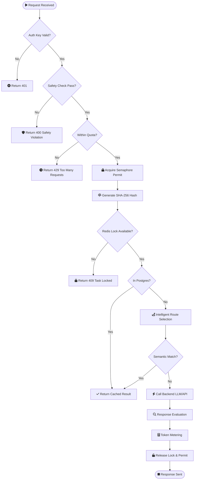
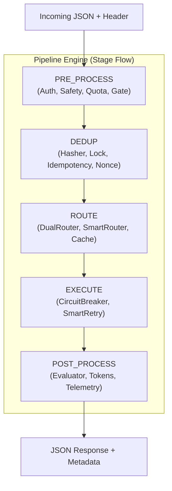
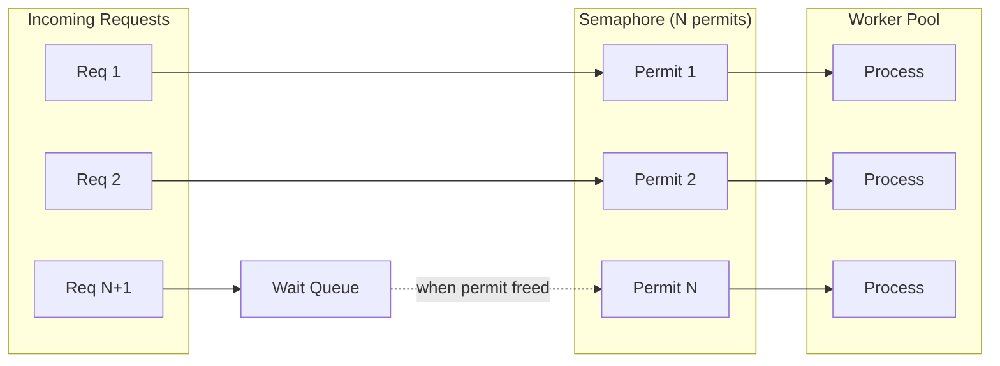
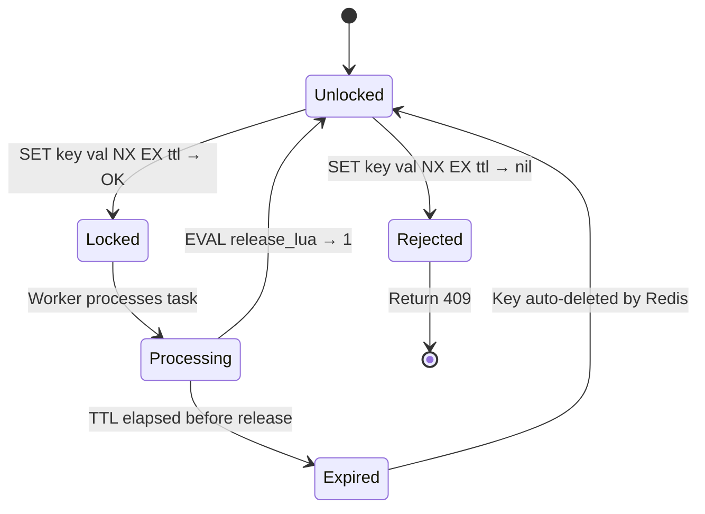

The following diagram details the internal logic of the `Pipeline.execute()` method as it processes a request through all 10 feature steps.




## 1. Pipeline Engine (Core Framework)

### Purpose

The central middleware framework that runs plugins in stage order. Every request flows through the pipeline. Plugins register during startup; disabled plugins are never added to the chain.

### Internal Architecture



### Plugin Interface

```go
type Plugin interface {
    Name() string                          // "collision-detection"
    Stage() Stage                          // Which pipeline stage
    Order() int                            // Execution order within stage
    Init(config map[string]string) error   // Setup (DB connections, etc.)
    Middleware() MiddlewareFunc            // The request-processing logic
    Close() error                          // Cleanup on shutdown
}

type MiddlewareFunc func(ctx *RequestContext, next func() error) error
```

### RequestContext (shared across all plugins)

```go
type RequestContext struct {
    RawPayload    []byte
    PayloadHash   string
    RequestID     string
    Nonce         *int64                   // nil if not provided by client
    Route         string                   // "rest" or "mcp"
    Result        interface{}
    Status        string
    HttpStatus    int                      // e.g. 200, 401, 429, 409
    Metrics       map[string]int64         // wait_ms, tokens_input, etc.
    Metadata      map[string]string        // auth_user_id, safety_violation, etc.
    Warnings      []string                 // Non-fatal issues
    Error         error                    // First fatal error
}
```

### Pipeline Build at Startup

```go
func BuildPipeline(config Config) *Pipeline {
    p := NewPipeline()

    // Core (always registered)
    p.Register(&ConcurrencyGatePlugin{})
    p.Register(&PayloadHasherPlugin{})
    p.Register(&DistributedLockPlugin{})

    // Plugins (config-driven)
    if config.Plugins.CollisionDetection.Enabled {
        p.Register(&CollisionDetectionPlugin{})
    }
    if config.Plugins.SmartRetry.Enabled {
        p.Register(&SmartRetryPlugin{})
    }
    // ... other plugins

    p.SortByStageAndOrder()
    return p
}
```

At runtime, `pipeline.Execute(ctx)` iterates through registered plugins in stage order. Each plugin calls `next()` to pass control to the next plugin, or returns an error to short-circuit.

---

## 2. Concurrency Gate (Core Plugin)

### Purpose

Limits the number of requests being processed simultaneously to N permits, protecting downstream resources and maintaining predictable memory usage.

### Plugin Registration

```
Name:  "concurrency-gate"
Stage: PRE_PROCESS
Order: 1
```

### Internal Architecture



### Implementation

```java
class ConcurrencyGatePlugin implements Plugin {
    Semaphore semaphore    // fair=true for FIFO ordering
    AtomicLong activeCount
    AtomicLong totalProcessed
}
```

- `semaphore.acquire()` parks the virtual thread (does not block a carrier thread).
- `try/finally` guarantees `semaphore.release()`.
- Fair semaphore (`new Semaphore(permits, true)`) ensures requests are served in arrival order under contention.
- Each request runs on a virtual thread via `Executors.newVirtualThreadPerTaskExecutor()`.

---

## 3. Distributed Lock (Core Plugin)

### Purpose

Prevent duplicate processing of the same task payload across multiple gateway instances.

### Plugin Registration

```
Name:  "distributed-lock"
Stage: DEDUP
Order: 2
```

### Lock Lifecycle



### Lock Key Derivation

```
payload bytes → SHA-256 → hex string → "lock:" + hex
```

The SHA-256 hash ensures:
- Same payload always maps to the same lock key (deterministic).
- Different payloads virtually never collide (collision-resistant).

### Redis Commands

**Acquire:**
```
SET lock:{hash} {requestId} NX EX 30
```

**Release (Lua script):**
```lua
if redis.call("get", KEYS[1]) == ARGV[1] then
    return redis.call("del", KEYS[1])
else
    return 0
end
```

The Lua script runs atomically within Redis, preventing the check-then-delete race condition.

### Request ID Format

```
{first 12 chars of hash}-{nanosecond timestamp}
```

### Implementation

- Uses `JedisPooled` (connection-pooled Redis client).
- **Acquire:** `jedis.set(key, val, SetParams.setParams().nx().ex(ttl))` -- returns `"OK"` on success, `null` if already held.
- **Release:** `jedis.eval(RELEASE_LUA, List.of(key), List.of(val))` -- Lua script for atomic compare-and-delete.

---

## 4. Payload Hasher (Core Plugin)

### Purpose

Generate a deterministic SHA-256 hash of the request payload for use as a deduplication key, lock key, and idempotency key.

### Plugin Registration

```
Name:  "payload-hasher"
Stage: DEDUP
Order: 1
```

### Implementation

```
Input:  raw payload bytes
Output: 64-character lowercase hex string
```

```java
MessageDigest md = MessageDigest.getInstance("SHA-256");
byte[] digest = md.digest(payloadBytes);
String hash = HexFormat.of().formatHex(digest);  // 64-char hex
```

The hasher sets `ctx.PayloadHash` on the `RequestContext`, which downstream plugins (lock, idempotency, collision detection) consume.

---

## 5. HTTP Server & Routing

### Endpoint Map

| Path | Handler | Method |
|---|---|---|
| `/task` | Full plugin pipeline | POST |
| `/healthz` | Health check | GET |
| `/metrics` | JSON gate utilization + aggregated exporter stats | GET |

Planned (Step 4+): `/metrics/prometheus`, `/metrics/locks`, `/clear-collision`, `/task/{hash}/status` when corresponding plugins exist.

### Response Format

All implemented endpoints return `Content-Type: application/json`.

Error responses include an `error` field when applicable. Success responses include a `status` field.

### Port

| Default Port | Env Variable |
|---|---|
| 8080 | `PORT` |

---

## 6. AI Safety & Quality Plugins

### Safety Guardrails
- **Purpose**: Detect jailbreaks and restricted topics in-line.
- **Stage**: `PRE_PROCESS` (Order 3).
- **Logic**: Fast regex matching against `(?i)ignore.*instructions` and keyword denylists (e.g., weapons, hacking). Returns 400 on violation.

### Response Evaluator
- **Purpose**: Detect hallucinations and check grounding.
- **Stage**: `POST_PROCESS` (Order 4).
- **Logic**: Heuristic-based inspection of `ctx.Result`. Checks for refusal patterns ("As an AI...") and grounding against `context` fields in request body.

---

## 7. Production Security Plugins

### API Key Auth
- **Purpose**: Validate caller credentials.
- **Stage**: `PRE_PROCESS` (Order 0).
- **Logic**: Extracts `X-API-Key` header. Validates prefix (`sk-sentinel-`) and extracts `auth_user_id`. In production, this performs a Redis O(1) lookup.

### Client Quota
- **Purpose**: Per-client rate limiting.
- **Stage**: `PRE_PROCESS` (Order 4).
- **Logic**: Uses a Redis sliding window (or `INCR` + `EXPIRE` per minute). Limits are keyed by `auth_user_id`.

---

## 8. Cost & Orchestration Plugins

### Token Meter
- **Purpose**: Cost estimation.
- **Stage**: `POST_PROCESS` (Order 5).
- **Logic**: Naive 4-char-per-token heuristic for input (`RawPayload`) and output (`Result`). Records to `ctx.Metrics`.

### Intelligent Router
- **Purpose**: Model selection and failover.
- **Stage**: `ROUTE` (Order 4).
- **Logic**: Selects route (e.g., `gpt-4o-mini` vs `gpt-4-turbo`) based on prompt length and complexity. Sets `fallback_route` for retry logic.
