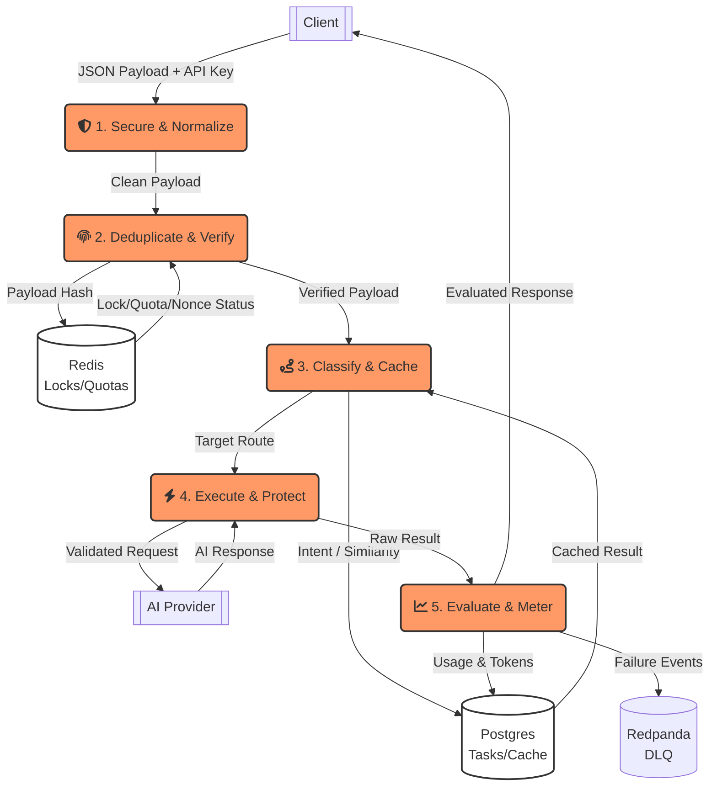
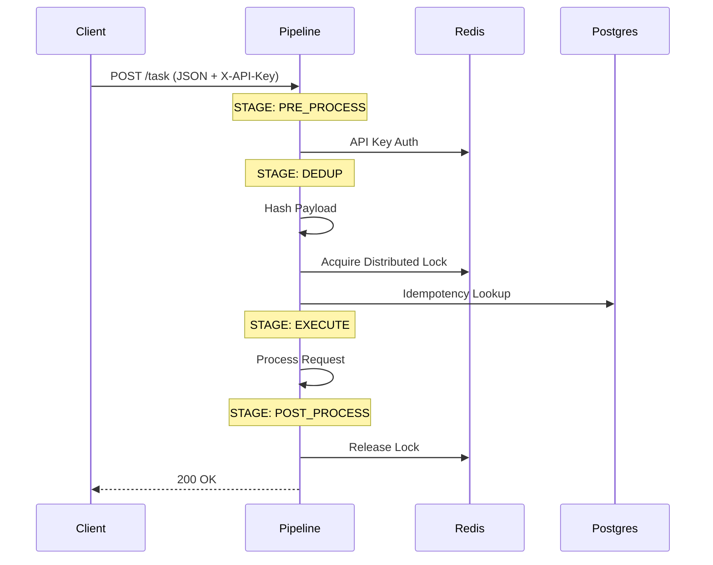
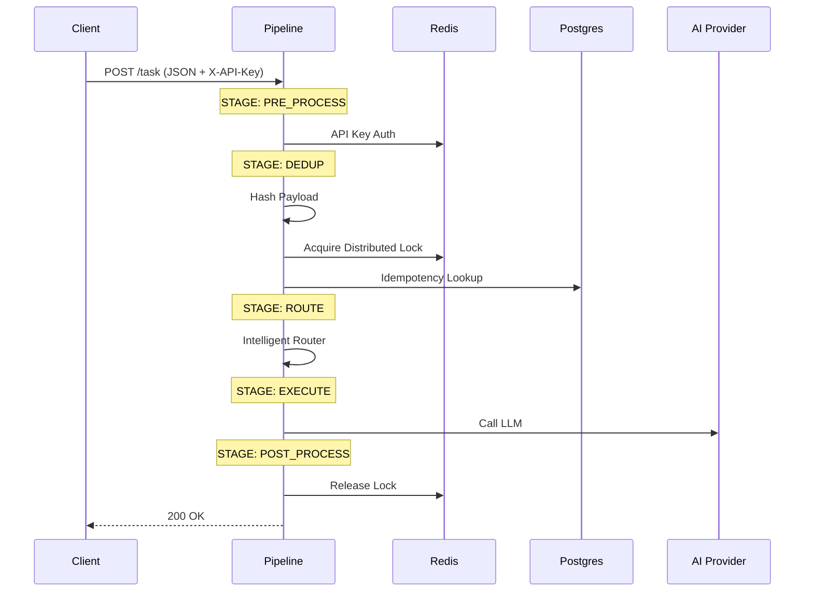
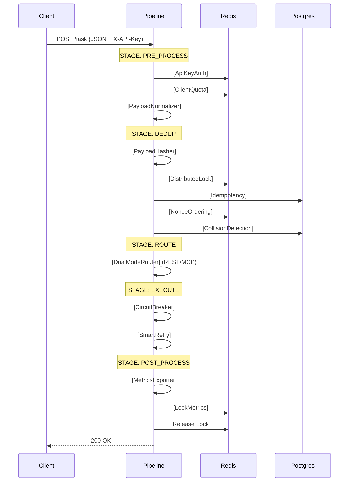
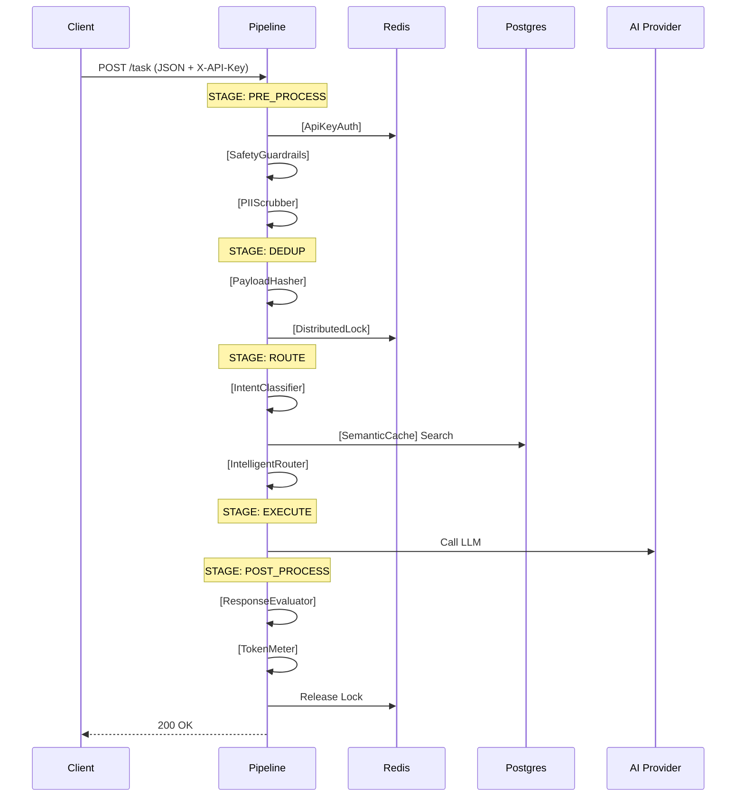
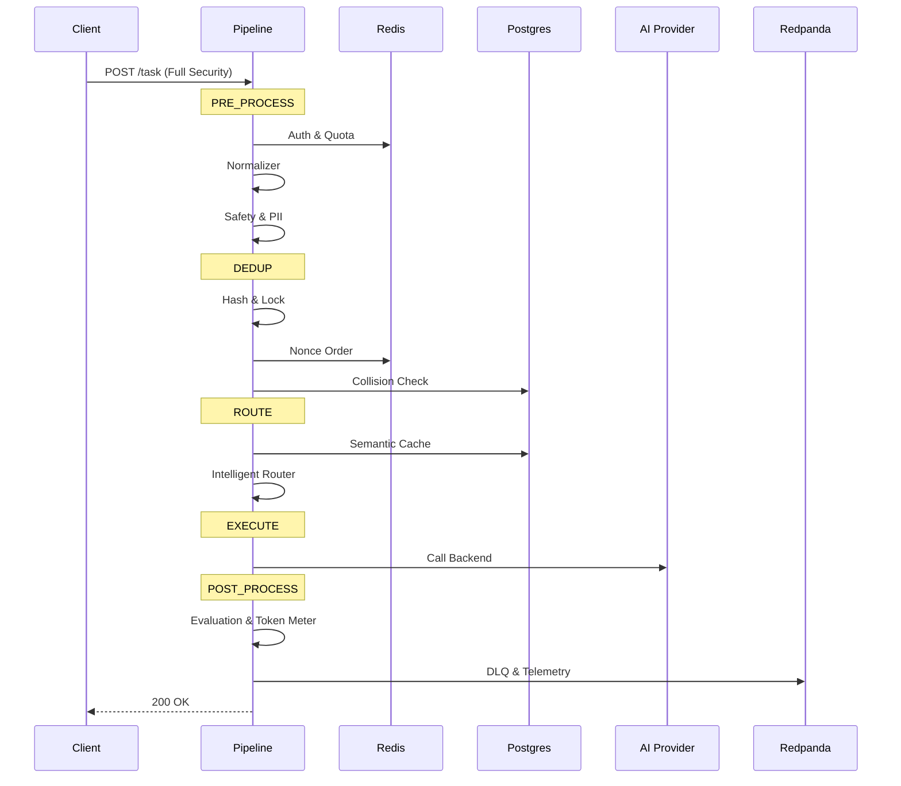
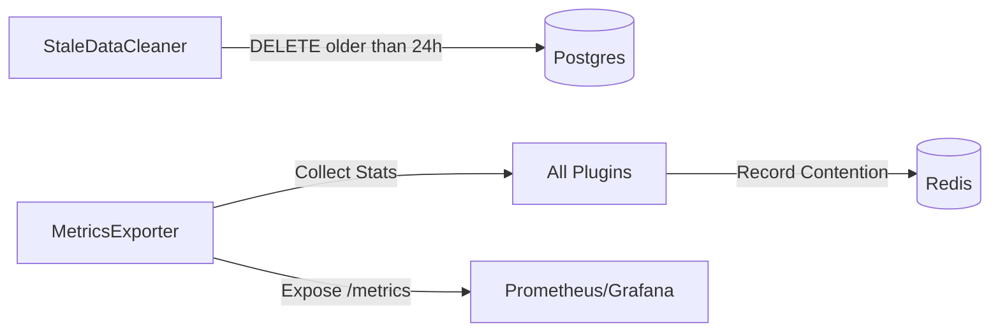

# LumeBridge: Master Architecture & Data Flow

This document is the primary reference for the LumeBridge architecture. It combines high-level data flow diagrams (DFD), per-profile sequence diagrams, and database forensic details into a single source of truth.

---

## 1. High-Level Data Flow (Gane-Sarson Style)

This diagram shows how data flows between external entities, core processes, and persistent data stores.



---

## 2. Profile-Specific Request Lifecycles

Different profiles activate different "stops" along the data highway. 

````carousel
### 1. api-minimal (Core API)

<!-- slide -->
### 2. ai-minimal (Core AI)

<!-- slide -->
### 3. api-pro (Production API)

<!-- slide -->
### 4. ai-pro (Production AI)

<!-- slide -->
### 5. hybrid (Full Suite)

````

---

## 3. Internal Data State (The "Forensic" View)

As data flows through the gateway, it is persisted in Postgres and Redis.

### Postgres: `tasks` Table
| Column | Data Type | Production Value Example | Rationale |
|---|---|---|---|
| `payload_hash` | TEXT | `b3685ae...` | Used for instant deduping and caching. |
| `payload` | TEXT | `<user_input>My email is [SHA256]...</user_input>` | Stores the **guarded** and **scrubbed** version. |
| `result` | JSONB | `{"content": "Hello!"}` | The cached response from the model. |
| `metrics` | JSONB | `{"gate_wait_ms": 2}` | Used for cost and performance analysis. |

### Redis: Global State
| Key Pattern | Data Store | Usage |
|---|---|---|
| `lock:{hash}` | Distributed Lock | Prevents multiple instances from processing the same task. |
| `quota:{user}:{min}` | Rate Limiter | Enforces per-client quotas across the cluster. |
| `nonce:{user}` | Nonce Manager | Ensures strictly increasing request order. |

---

## 4. Clustered Production Deployment

LumeBridge is designed for a **Cloud-Native Clustered Architecture**:

1.  **Ingress (Stateless)**: Multiple gateway instances handle traffic behind a Load Balancer.
2.  **Shared State (Redis)**: Ensures consistency for locks and quotas across all instances.
3.  **Durable Audit (Postgres)**: Single source of truth for task history and vector embeddings.
4.  **Telemetry (Redpanda)**: Async streaming of logs and errors for real-time monitoring.

---

## 5. Summary Table: Profile Capabilities

| Feature | `api-minimal` | `ai-minimal` | `api-pro` | `ai-pro` | `hybrid` |
|---|---|---|---|---|---|
| **Deduplication** | ✅ | ✅ | ✅ | ✅ | ✅ |
| **PII Scrubbing** | ❌ | ❌ | ❌ | ✅ | ✅ |
| **Safety Guardrails** | ❌ | ❌ | ❌ | ✅ | ✅ |
| **Intelligent Routing**| ❌ | ✅ | ❌ | ✅ | ✅ |
| **DLQ / Telemetry** | ❌ | ❌ | ❌ | ❌ | ✅ |

---

## 6. Internal Data Structure: `RequestContext`

The `RequestContext` is the primary object passed between plugins. It is mutable and accumulates state as the request progresses.

| Field | Description | Set By |
|---|---|---|
| `auth_user_id` | Identified user/service | `ApiKeyAuthPlugin` |
| `payload_hash` | Unique request fingerprint | `PayloadHasherPlugin` |
| `route` | Target backend/model | `IntelligentRouterPlugin` |
| `tokens_input` | Estimated prompt tokens | `TokenMeterPlugin` |
| `safety_violation`| Flag if prompt was malicious | `SafetyGuardrailsPlugin` |

---

## 7. Background Maintenance Operations

Independent of the request flow, the following processes maintain system health.


